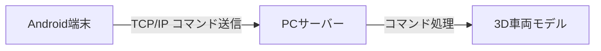
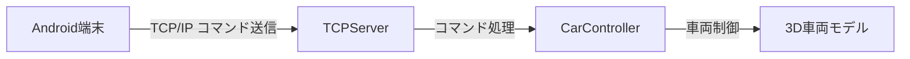

# MobileCpntroller 技術仕様書

## 1. システム概要
- **目的**: Android端末をコントローラーとして使用し、TCP/IP通信で3D車両を遠隔操作
- **アーキテクチャ**: クライアント・サーバーモデル
- **開発環境**: Unity 2022.3 LTS

## 2. 技術仕様
### 2.1 通信仕様

- **プロトコル**: TCP/IP
- **ポート番号**: デフォルト 8080
- **データ形式**: 文字列コマンド（例: "UP", "DOWN", "LEFT", "RIGHT"）

### 2.2 主要コンポーネント
1. **TCPServer (サーバー側)**
   - クライアント接続管理
   - コマンド受信・処理
   - 車両制御コマンドの実行

2. **TCPClient (Androidクライアント)**
   - サーバー接続管理
   - ボタン操作をコマンドに変換
   - コマンド送信

3. **CarController**
   - 車両の物理挙動制御
   - 受信コマンドに基づく動作実行

## 3. データフロー


## 4. セットアップ手順
### 4.1 サーバー起動
```
1. PCでアプリを起動
2. サーバーとして使用するPCのIPアドレスを入力
3. Startボタンを押してサーバーを起動
```

### 4.2 クライアント接続
```
1. Android端末でアプリを起動
2. サーバーのIPアドレスを入力
   (例: 192.168.1.100)
3. Connectボタンを押す
4. コントローラーで操作開始
```

## 5. コマンド一覧
| ボタン | 送信コマンド | 動作説明 |
|--------|--------------|----------|
| ↑      | UP           | 前進     |
| ↓      | DOWN         | 後退     |
| ←      | LEFT         | 左旋回   |
| →      | RIGHT        | 右旋回   |

## 6. 解説動画
MobileController\Movies\MobileController解説.mp4